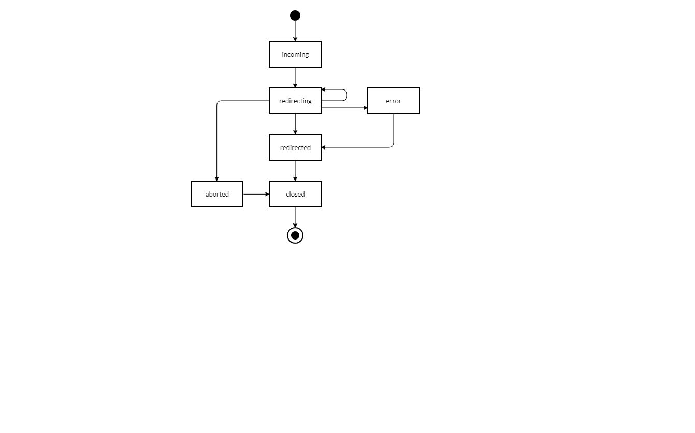

# Server events

The REserve server object implements the [EventEmitter](https://nodejs.org/api/events.html) class and throws [**events with parameters**](events.md) to **notify** any listener of **its activity**.

When a **request is being dispatched**, the following diagram illustrates the **sequence of events that are emitted**.

| Event | Parameter *(object containing members)* | Description |
|---|---|---|
| **server-created** | <ul><li>`server` *([`http.server`](https://nodejs.org/api/http.html#http_class_http_server) or [`https.server`](https://nodejs.org/api/https.html#https_class_https_server))*</li><li>`configuration` *([configuration interface](#configuration-interface))*</li></ul>| Only available to `listeners`, this event is triggered after the HTTP(S) server is **created** and **before it accepts requests**.<small> Added in version 1.7.0</small>
| **ready** | <ul><li>`url` *(String, example : `'http://0.0.0.0:8080/'`)*</li><li>`port` *(Number, example : `8080`)*</li><li>`http2` *(Boolean, example : `false`)*</li></ul> | The server is listening and ready to receive requests, hostname is replaced with `0.0.0.0` when **unspecified**. <small> `port` was added in version 1.9.3, `http2` was added in version 1.11.0</small>
| **incoming** | <ul><li>`method` *(String, example : `'GET'`)*</li><li>`url` *(String)*</li><li>`start` *(Date)*</li><li>`id` *(Number)*</li><li>`internal` *(Boolean)*</li></ul> | New request received, the `id` is a unique request identifier, the `internal` flag signals internally dispatched request (see [configuration interface](handler.md#configuration-interface)). These parameters are also transmitted to **error**, **redirecting**,**redirected**, **aborted** and **closed** events.<small> `id` was added in version 1.9.0 `internal` was added in version 1.11.0</small>|
| **error** | `reason` *(Any)* | Error reason, contains **incoming** parameters only if the error is related to a request. |
| **redirecting** | *same parameters as **incoming***<ul><li>`type` *(Handler type, example : `'status'`)*</li><li>`redirect` *(String or Number, example : `404`)*</li></ul> | Processing redirection to handler, gives handler type and redirection value.  *For instance, when a request will be served by the [file handler](#file), this event is generated once. But if the requested resource does not exist, the request will be redirected to the [status](#status) 404 triggering again this event.* |
| **redirected** | *same parameters as **incoming***<ul><li>`end` *(Date)*</li><li>`timeSpent` *(Number of ms)*</li><li>`statusCode` *(Number)*</li></ul> | Request is fully processed. `timeSpent` is evaluated by comparing `start` and `end` (i.e. not using high resolution timers) and provided for information only. |
| **aborted** | *same parameters as **incoming*** | Request was [aborted](https://nodejs.org/api/http.html#http_event_aborted).<small> Added in version 1.9.0</small> |
| **closed** | *same parameters as **incoming*** | Request underlying connection was [closed](https://nodejs.org/api/http.html#http_event_close_2). <small> Added in version 1.9.0</small>|
