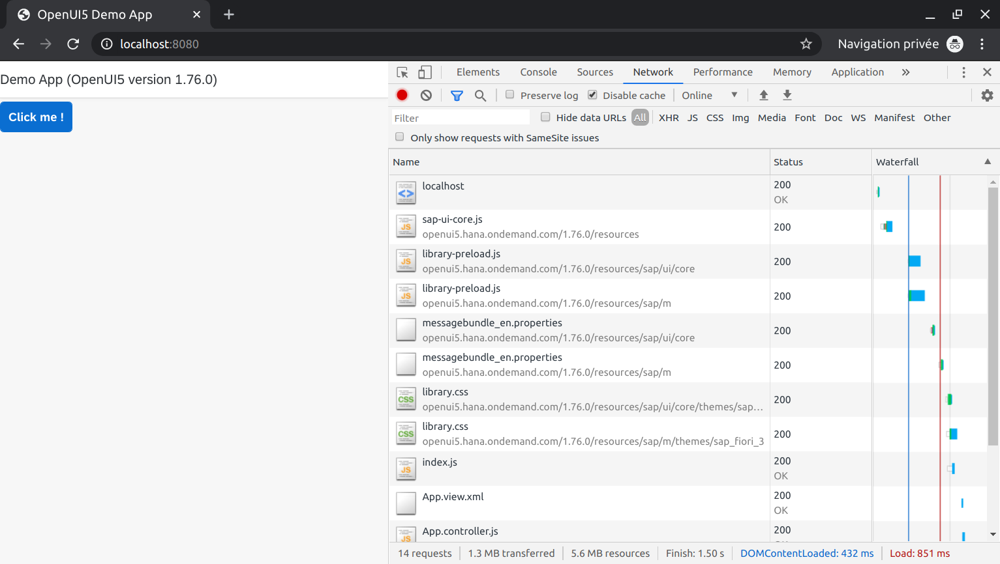
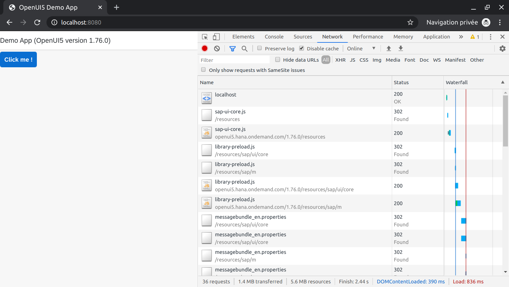
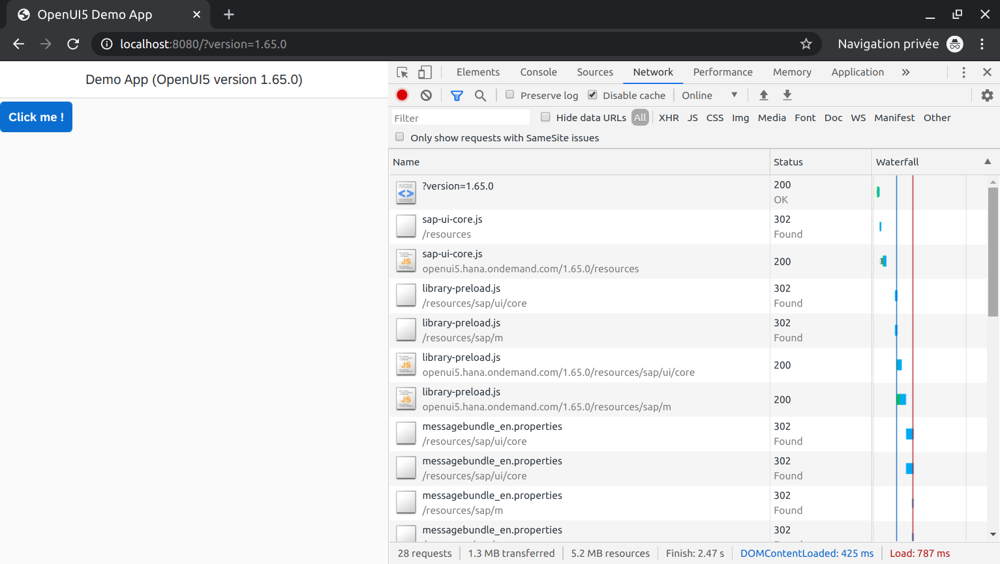
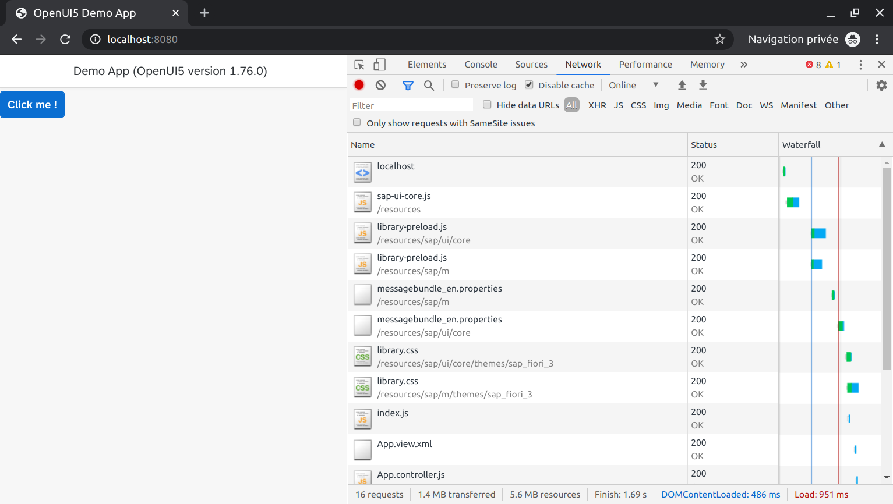
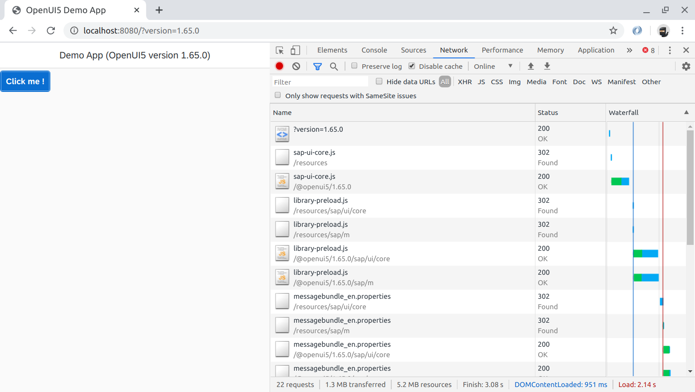

# Serving an OpenUI5 application

The best way to explain **what REserve can do** is to demonstrate some of its features through a **concrete use case**.
In this article, we will illustrate how one can quickly setup a server to **facilitate the development of OpenUI5 applications**.

## Quick presentation of OpenUI5

### Overview


[OpenUI5](https://openui5.org/) is a **free** and **open source** JavaScript framework to develop **enterprise-grade** and **responsive** applications.

It offers some **efficient** development concepts, such as :
* The Model View Controller (**MVC**) pattern
* **XML** definition of views
* Two-way **bindings**
* Controls development with **fast rendering**
* ODATA integration
* Testing helpers (qUnit / [OPA](https://youtu.be/HiZq-kuIbt0))
* ...

More information can be found in [the documentation](https://openui5.hana.ondemand.com/).

### Building an OpenUI5 application

The community around the framework is **growing** and **several tools** are publicly available in the [NPM repository](https://www.npmjs.com/search?q=openui5).

In particular, when it comes to building an application, you must add the following NPM packages to your project :

* [@ui5/cli](https://www.npmjs.com/package/@ui5/cli) : it contains the required **[tooling](https://github.com/SAP/ui5-tooling#ui5-tooling) to initiate, serve and build your application**.<br />It cumulates [27 MB](https://packagephobia.now.sh/result?p=@ui5/cli) of files *(including dependencies)*.

* [@openui5/sap.ui.core](https://www.npmjs.com/package/@openui5/sap.ui.core) : this is the UI5 **core runtime**.<br /> It takes [26.4 MB](https://packagephobia.now.sh/result?p=@openui5/sap.ui.core).

* [@openui5/sap.m](https://www.npmjs.com/package/@openui5/sap.m) : this is the main UI5 control library, with responsive controls that can be used in touch devices as well as desktop browsers.<br /> It weights [10.2 MB](https://packagephobia.now.sh/result?p=@openui5/sap.m).

* [@openui5/themelib_sap_fiori_3](https://www.npmjs.com/package/@openui5/themelib_sap_fiori_3) : the default theme *(including specific fonts)*. <br /> It requires [4.2 MB](https://packagephobia.now.sh/result?p=@openui5/themelib_sap_fiori_3).

In the end, you basically need a total of **60 MB of packages** to start coding your application. Such a **digital footprint is quite common** for a standard Node.js development environment in which you can handle the **full lifecycle of your application** (serving, validating, minifying...).

Once the **application is finalized**, depending on **its dependencies**, the deployment will live in a **fraction of this size**.

There is one **little drawback** to this model. After installing all these packages, the project is **bound to the downloaded version of OpenUI5**. Since a new release of UI5 is done almost **every month**, it might be interesting to **switch between versions**.

However, this means **cleaning the package list and install new ones**.

That can be a **tedious process** but, good news, the [version 2 of the cli tools](https://youtu.be/v6ImEbZRRlg) offers a mechanism to **simplify** this step.

### OpenUI5 Content Delivery Network

The framework is built on top of a [smart dependency management model](https://openui5.hana.ondemand.com/api/sap.ui#methods/sap.ui.define) that is capable of loading the missing dependencies when needed. To put it in a nutshell, these **additional modules** are usually **relative to the location where the [UI5 bootstrap](https://openui5.hana.ondemand.com/1.76.0/resources/sap-ui-core.js)** is obtained.

Furthermore, each released version of UI5 is available from the public CDN:
* 1.76.0 is available under [https://openui5.hana.ondemand.com/1.76.0/resources/](https://openui5.hana.ondemand.com/1.76.0/resources/sap-ui-version.json)
* 1.75.0 is available under [https://openui5.hana.ondemand.com/1.75.0/resources/](https://openui5.hana.ondemand.com/1.75.0/resources/sap-ui-version.json)
* ...
* 1.65.0 is available under [https://openui5.hana.ondemand.com/1.65.0/resources/](https://openui5.hana.ondemand.com/1.65.0/resources/sap-ui-version.json)
* ...

## Sample application

Let's consider a **simple demonstration application** that consists in one view and one button. The **current version of OpenUI5** is displayed in the title as shown below. The source of the application can be found in the [REserve repository](https://github.com/ArnaudBuchholz/reserve/tree/master/samples/openui5/webapp).


<u>*Sample demonstration application*</u>

In the first version of the bootstrap (`static.html`), the UI5 framework is **loaded from the CDN**.

```html
<!DOCTYPE html>
<html>
<head>
  <meta charset="utf-8">
  <title>OpenUI5 Demo App</title>
  <script id="sap-ui-bootstrap"
    src="https://openui5.hana.ondemand.com/1.76.0/resources/sap-ui-core.js"
    data-sap-ui-theme="sap_fiori_3"
    data-sap-ui-libs="sap.m"
    data-sap-ui-resourceroots='{"Demo": "./"}'
    data-sap-ui-onInit="module:Demo/index"
    data-sap-ui-compatVersion="edge"
    data-sap-ui-async="true">
  </script>
</head>
<body class="sapUiBody" id="content"></body>
</html>
```

<u>*OpenUI5 is loaded from the CDN as specified in the `static.html` bootstrap*</u>

When opening this **file directly in a browser**, the application **fails to load**. This is because it tries to load some resources from the file system using the [XMLHttpReques](https://developer.mozilla.org/en-US/docs/Web/API/XMLHttpRequest) object.


<u>*Loading the application from the file system fails*</u>

To work properly, the application must be served using the **http protocol**.

### REserve to the rescue

Here are the steps to build a web server using [REserve](https://www.npmjs.com/package/reserve).
1. First you need to [install Node.js](https://nodejs.org/en/download/)
2. Node.js comes with [NPM](https://www.npmjs.com/get-npm) but it may be updated separately using `npm install npm@latest -g`
3. Install REserve *globally* using `npm install reserve -g` *(it is not mandatory to make it global but this is the fastest way to use it)*
4. Define a [**configuration file**](https://www.npmjs.com/package/reserve#configuration) that describes how the incoming requests must be served *(all paths are relative to the configuration file)*

```json
{
  "port": 8080,
  "mappings": [{
    "match": "^/$",
    "file": "./webapp/static.html"
  }, {
    "match": "^/(.*)",
    "file": "./webapp/$1"
  }]
}
```

<u>*`static.json` configuration file*</u>

The above configuration contains only two mappings:
* The first handles requests accessing **the root of the website** and serves them using the [file handler](https://www.npmjs.com/package/reserve#file) configured with the file `static.html`
* The second one **[captures](https://developer.mozilla.org/en-US/docs/Web/JavaScript/Guide/Regular_Expressions/Groups_and_Ranges) the URL** and **map it directly** to the file system using the **substitution parameter** `$1` *(see [Capturing groups and interpolation](https://www.npmjs.com/package/reserve#capturing-groups-and-interpolation))*

To start the server, simply execute `reserve --config static.json`.

Then, when the browser points to [`http://localhost:8080`](http://localhost:8080), the application **loads properly** as shown below.



<u>*The application running with REserve*</u>

In the meantime, REserve **traces all the request it receives** *(colors are available if you also install globally the [colors](https://www.npmjs.com/package/colors) package)*.


<u>*Console output of REserve*</u>

## Changing the UI5 version

What if we would like to test the application with a **different version of OpenUI5** ? On one hand, a **simple change** in the `static.html` file would be enough. On the other hand, we could **decouple** the HTML bootstrap file from a given version and **rely on REserve to provide this information**.

In the new bootstrap file, OpenUI5 file is loaded through a **relative URL** (`./resources/sap-ui-core.js`). If you inspect the [directory structure](https://github.com/ArnaudBuchholz/reserve/tree/master/samples/openui5/webapp), such **path does not exist**.

REserve will **fill the gap**.

```html
<!DOCTYPE html>
<html>
<head>
  <meta charset="utf-8">
  <title>OpenUI5 Demo App</title>
  <script id="sap-ui-bootstrap"
    src="./resources/sap-ui-core.js"
    data-sap-ui-theme="sap_fiori_3"
    data-sap-ui-libs="sap.m"
    data-sap-ui-resourceroots='{"Demo": "./"}'
    data-sap-ui-onInit="module:Demo/index"
    data-sap-ui-compatVersion="edge"
    data-sap-ui-async="true">
  </script>
</head>
<body class="sapUiBody" id="content"></body>
</html>
```

<u>*OpenUI5 is loaded through a non existing path in the `index.html` bootstrap*</u>

### Using HTTP redirect

One way to implement this path is to **instruct the browser to get the file from a different URL** when accessing the non existing one. For instance, when `/resources/sap-ui-core.js` is requested, REserve answers with the **[HTTP 302](https://developer.mozilla.org/en-US/docs/Web/HTTP/Status/302) status code** and the information to get the resource from `https://openui5.hana.ondemand.com/1.76.0/resources/sap-ui-core.js`.

The [status handler](https://www.npmjs.com/package/reserve#status) takes care of answering the request.

```json
{
  "port": 8080,
  "mappings": [{
    "match": "/resources/(.*)",
    "headers": {
      "Location": "https://openui5.hana.ondemand.com/1.76.0/resources/$1"
    },
    "status": 302
  }, {
    "match": "^/(\\?.*)?$",
    "file": "./webapp/index.html"
  }, {
    "match": "^/(.*)",
    "file": "./webapp/$1"
  }]
}
```

<u>*`redirect.json` configuration file*</u>

When running this configuration file, the network traces of the browser show that **those resources involve two requests** :
* The first ones gets status 302 from REserve
* The second ones gets the resources from the CDN



<u>*The network traces show the redirect mechanism*</u>

However, **only the requests** hitting REserve are traced, as shown below.


<u>*REserve traces showing the HTTP Status 302 answers*</u>

### Changing the version dynamically

Whenever a browser makes a request, it usually transmits **additional information** to give context. In particular, the **[Referer header](https://developer.mozilla.org/en-US/docs/Web/HTTP/Headers/Referer)** contains the address of the **web page accessing the resource**.

Based on this **standard feature**, the code can be adjusted to **extract an URL parameter** and redirect to the **expected version** of OpenUI5. Fortunately, the [custom handler](https://www.npmjs.com/package/reserve#custom) allows custom code extensions to REserve.

```json
{
  "port": 8080,
  "mappings": [{
    "match": "/resources/(.*)",
    "custom": "./redirect-version.js"
  }, {
    "match": "^/(\\?.*)?$",
    "file": "./webapp/index.html"
  }, {
    "match": "^/(.*)",
    "file": "./webapp/$1"
  }]
}
```

<u>*`redirect-version.json` configuration file*</u>

The custom handler **simplifies the processing** by calling an **asynchronous function** with the [request](https://nodejs.org/api/http.html#http_class_http_incomingmessage) and [response](https://nodejs.org/api/http.html#http_class_http_serverresponse) objects. Any **capturing group value** is passed as **additional parameters**.
REserve knows that the request is **fully answered** when the response is **finalized by calling [`end`](https://nodejs.org/api/http.html#http_response_end_data_encoding_callback)**.

In the following code, the request object is used to **extract the Referer header**, then the **`version` parameter is captured** *(if any)* and the **HTTP 302 response** is built using [`response.writeHead`](https://nodejs.org/dist/latest/docs/api/http.html#http_response_writehead_statuscode_statusmessage_headers).

```JavaScript
module.exports = async function (request, response, ui5Path) {
  const { referer } = request.headers
  const version = (/\bversion\b=(\d+\.\d+\.\d+)/.exec(referer) || [0, '1.76.0'])[1]
  response.writeHead(302, {
    Location: `https://openui5.hana.ondemand.com/${version}/resources/${ui5Path}`
  })
  response.end()
}
```

<u>*`redirect-version.js` custom code*</u>

When running this new configuration file, one can now specify a **version number inside the URL** such as `localhost:8080?version=1.65.0` as demonstrated below.



<u>*The demonstration application running with version 1.65.0 of OpenUI5*</u>

As far as the traces are concerned, this does not change the output of REserve.


<u>*REserve traces showing the HTTP Status 302 answers*</u>


>>>>> TODO

### Content Security Policy

What happens if the website hosting the application is **configured to forbid the execution of remote code** ? This condition is easily testable by adding a new mapping that injects the [Content-Security-Policy header](https://developer.mozilla.org/en-US/docs/Web/HTTP/CSP).

This new mapping has no `match` specification, meaning **it applies to all requests going through it**. But, in the end, only the one serving the bootstrap file is relevant.

```json
{
  "port": 8080,
  "mappings": [{
    "match": "/resources/(.*)",
    "headers": {
      "Location": "https://openui5.hana.ondemand.com/1.76.0/resources/$1"
    },
    "status": 302
  }, {
    "custom": "./csp.js"
  }, {
    "match": "^/(\\?.*)?$",
    "file": "./webapp/index.html"
  }, {
    "match": "^/(.*)",
    "file": "./webapp/$1"
  }]
}
```

<u>*`redirect-csp.json` configuration file*</u>

The file `csp.js`, detailed below, adds the `Content-Security-Policy` header to tell the browser to trust only code coming from the website that served the `index.html` file.

```JavaScript
module.exports = async function (request, response) {
  response.setHeader('Content-Security-Policy', 'default-src \'self\'')
}
```

<u>*`csp.js` custom code file*</u>

Since **OpenUI5 resources are served from a CDN** after the request is being redirected, it leads to an **error** as shown in the network traces and the application **fails to load**.


<u>*The network traces show the request is blocked*</u>

As a consequence, only few traces are dumped in the REserve console.


<u>*Only two requests reached REserve*</u>

### Proxy

The [url handler](https://www.npmjs.com/package/reserve#url) is capable of **forwarding an incoming request to any URL** and **tunnel the answer back to the client**. Thus, the mapping doing the **redirect is replaced with a new one** as shown below.

```json
{
  "port": 8080,
  "mappings": [{
    "match": "/resources/(.*)",
    "url": "https://openui5.hana.ondemand.com/1.76.0/resources/$1"
  }, {
    "custom": "./csp.js"
  }, {
    "match": "^/(\\?.*)?$",
    "file": "./webapp/index.html"
  }, {
    "match": "^/(.*)",
    "file": "./webapp/$1"
  }]
}
```

<u>*`proxy-csp.json` configuration file*</u>

When running this new configuration file, the application is **back to normal**. The network traces show that **all resources are served by `localhost`** as illustrated below.



<u>*The application runs as if all resources are local*</u>


### proxy-csp-version

```json
{
  "port": 8080,
  "mappings": [{
    "match": "/@openui5/([^/]*)/(.*)",
    "url": "https://openui5.hana.ondemand.com/$1/resources/$2"
  }, {
    "match": "/resources/(.*)",
    "custom": "./proxy-version.js"
  }, {
    "custom": "./csp.js"
  }, {
    "match": "^/(\\?.*)?$",
    "file": "./webapp/index.html"
  }, {
    "match": "^/(.*)",
    "file": "./webapp/$1"
  }]
}
```

```JavaScript
module.exports = async function (request, response, ui5Path) {
  const { referer } = request.headers
  const version = (/\bversion\b=(\d+\.\d+\.\d+)/.exec(referer) || [0, '1.76.0'])[1]
  response.writeHead(302, {
    Location: `/@openui5/${version}/${ui5Path}`
  })
  response.end()
}
```




## Conclusion
