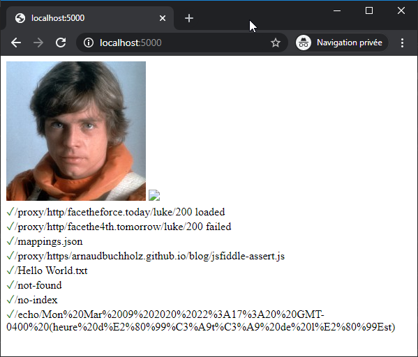

# Tests & Quality

After drafting the first version of [REserve](https://npmjs.com/package/reserve), some of the remaining **challenges** included **behavior validation** and **quality assessment**. This article will detail the different **strategies** adopted for **testing** as well as the **tooling** used to ensure the **quality** of the project.

## Basic testing

When it comes to web application testing, there are many ways to deal with it. On one hand, you may use [selenium-based tools](https://www.guru99.com/automated-testing-tools.html) (or any [alternative](https://www.guru99.com/selenium-alternatives.html)) to **automate a browser**, run a given set of **scenario** and assess the **expected results**. On the other hand, you may leverage a simple **http client** *(for instance [curl](https://curl.haxx.se/) or Node.js' [request](https://www.npmjs.com/package/request))* and **analyze the responses**.

> But, with regards to this project, the most important thing is to validate the way the server behaves. Since it is very flexible, every possible configuration should be tested and the error management should be finely controlled.


The initial - a.k.a. basic - test is a **small website illustrating most of the features** that is run with a browser. First, a [mappings.json](https://github.com/ArnaudBuchholz/reserve/blob/master/tests/mappings.json) file contains a mix of different handlers and mappings. Then, two additional files extend this definition to  expose it through [http](https://github.com/ArnaudBuchholz/reserve/blob/master/tests/http.json) and [https](https://github.com/ArnaudBuchholz/reserve/blob/master/tests/https.json).

```json
{
  "mappings": [{
    "match": "^/proxy/(https?)/(.*)",
    "url": "$1://$2",
    "unsecure-cookies": true
  }, {
    "match": "^/echo/(.*)$",
    "custom": "./echo.js"
  }, {
    "match": "^/chrome/(.*)$",
    "custom": "./chrome.js"
  }, {
    "match": "^/gpf\\.js$",
    "file": "../node_modules/gpf-js/build/gpf.js"
  }, {
    "match": "(.*)",
    "file": "./$1"
  }]
}
```
<u>*Initial mappings used to prototype REserve*</u>

```json
{
  "extend": "./mappings.json",
  "port": 5000
}
```
<u>*http.json file used to expose mappings through http*</u>

A [web page](https://github.com/ArnaudBuchholz/reserve/blob/master/tests/index.html) is designed to test different URLs and everything is validated with a list of [assertions](https://github.com/ArnaudBuchholz/reserve/blob/master/tests/assertions.js) (thanks to the [gpf-js http](https://arnaudbuchholz.github.io/gpf/doc/gpf.http.html) helper).




mappings.json
extended by http.json, https.json
assertions.js based on gpf's http helper
index.html for browser testing
all.js for Node.js testing

## In-depth testing

Test cases are defined and executed
with mocha  


Node.js modules (fs, http, ...) mocking is possible
with [mock-require](https://www.npmjs.com/package/mock-require)  

## Continuous integration

Every push triggers a job that runs the tests and updates coverage info.
Travis https://travis-ci.org/ArnaudBuchholz/reserve

## Code coverage with Istanbul

Code coverage measurement is made simple
with [nyc](https://www.npmjs.com/package/nyc)

Results are uploaded to Coveralls platform Coveralls
https://coveralls.io/github/ArnaudBuchholz/reserve

## Code smells

Code Climate online platform performs code analysis to detect maintainability issues
https://codeclimate.com/github/ArnaudBuchholz/reserve

## Publishing

This project is my first experience
with NPM support.

The name was taken by an empty project, it has been reassigned after contacting the original owner.
