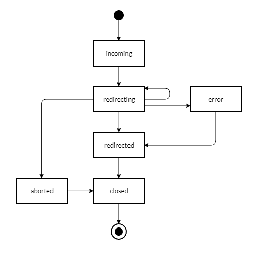

# Server events

The REserve server object implements an interface that mimics the [EventEmitter::on method](https://nodejs.org/api/events.html#emitteroneventname-listener) and triggers **events with parameters** to **notify** any listener of **its activity**.

When a **request is processed**, the following diagram illustrates the **sequence of events that are emitted**.

> Diagram of events emitted by REserve while processing a request

ⓘ These events are handled by the [`log`](log.md) helper.

| Event `eventName`| Parameters _`...members`_ | Description |
|---|---|---|
| `'created'` | <ul><li>`server` : [`http.server`](https://nodejs.org/api/http.html#http_class_http_server) \| [`https.server`](https://nodejs.org/api/https.html#https_class_https_server)</li><li>`configuration` : [`IConfiguration`](iconfiguration.md)</li></ul>| Only available to `listeners`, this event is emitted after the HTTP(S) server is **created** and **before it accepts requests**.
| **ready** | <ul><li>`url` : `string`</li><li>`port` : `number` </li><li>`http2` : `boolean`</li></ul> | The server is listening and ready to receive requests on the url *(for instance : `'http://192.168.4.1:8080/'` when no hostname is specified)*.
| **incoming** | <ul><li>`method` : `string` *(uppercase)*</li><li>`incomingUrl` : `String`</li><li>`url` : `string`</li><li>`headers` : `{ [key: string]: string \| string[] }`</li><li>`start` : `Date`</li><li>`id` : `number`</li><li>`internal` : `boolean` | New request received, the `id` is a unique request identifier, the `internal` flag signals internally dispatched request (see [configuration interface](iconfiguration.md#async-dispatch-request-response)). These parameters are also transmitted to **error**, **redirecting**,**redirected**, **aborted** and **closed** events.<small> `id` was added in version 1.9.0 `internal` was added in version 1.11.0 `headers` was added in version 1.11.2</small>|
| **error** | `reason` *(Any)* | Error reason, contains **incoming** parameters only if the error is related to a request. |
| **redirecting** | *same parameters as **incoming***<ul><li>`type` *(Handler type, example : `'status'`)*</li><li>`redirect` *(String or Number, example : `404`)*</li></ul> | Processing redirection to handler, gives handler type and redirection value.  *For instance, when a request will be served by the [file handler](#file), this event is generated once. But if the requested resource does not exist, the request will be redirected to the [status](#status) 404 triggering again this event.* |
| **redirected** | *same parameters as **incoming***<ul><li>`end` *(Date)*</li><li>`timeSpent` *(Number of ms)*</li><li>`statusCode` *(Number)*</li></ul> | Request is fully processed. `timeSpent` is evaluated by comparing `start` and `end` (i.e. not using high resolution timers) and provided for information only. |
| **aborted** | *same parameters as **incoming*** | Request was [aborted](https://nodejs.org/api/http.html#http_event_aborted).<small> Added in version 1.9.0</small> |
| **closed** | *same parameters as **incoming*** | Request underlying connection was [closed](https://nodejs.org/api/http.html#http_event_close_2). <small> Added in version 1.9.0</small>|
