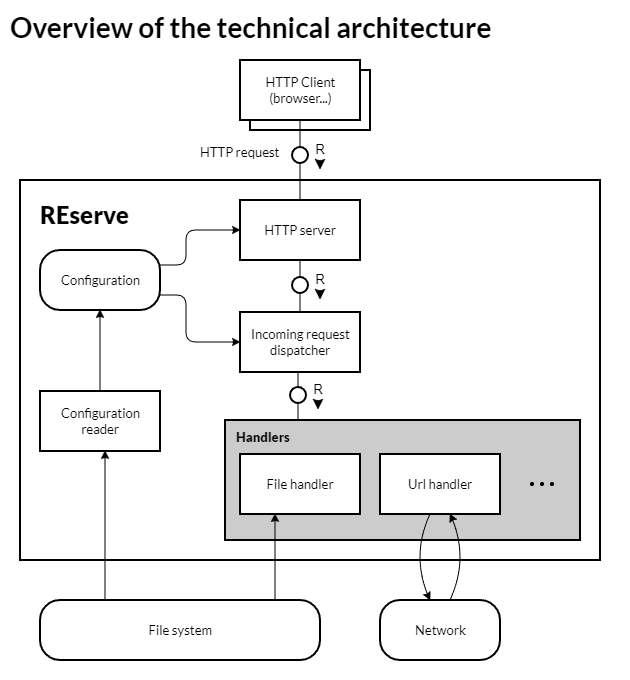

# Technical Details

Based on a **clean concept**, the development of [REserve](https://www.npmjs.com/package/reserve) follows a **simple architecture** that enables **flexibility** and **extensibility**.

This article provides keys to understand the **modular structure** of the implementation.

## Concept overview

By defining an **array of mappings**, one can decide how the server will process the incoming requests. Each mapping associates a **matching** criterion defined with a [regular expression](https://developer.mozilla.org/en-US/docs/Web/JavaScript/Reference/Global_Objects/RegExp) to a **handler** that will answer the request.

When a **mapping** is defined, its **association to the handler is made through a specific property** (called prefix; for instance : `file`).

The value of this property configures **how the handler must behave when executed**. For instance, the file handler expects a file path.

[Capturing groups](https://developer.mozilla.org/en-US/docs/Web/JavaScript/Guide/Regular_Expressions/Groups_and_Ranges) can be defined in the matching regular expression to **extract parts of the URL** and reuse them in the property *(they are identified with `$1`, `$2`... )*.

Consequently, the following mapping will match the URL `/sample/index.html` and serve the request with the file `./www/sample/index.html`.
```json
{
  "match": "^/(.*)",
  "file": "./www/$1"
}
```

## Implementation overview

REserve is designed on a **simple** architecture summarized by the following [Block diagram](https://blogs.sap.com/2008/02/19/how-to-communicate-architecture-technical-architecture-modeling-at-sap-part-2/)



> TAM Block diagram of the technical architecture

There are 4 main building blocks (a.k.a. agents) namely :

* The configuration reader
* The server
* The dispatcher
* The handlers

These are required to run the server but one last additional component **enables testing** : the mock one.

## Configuration

The configuration agent exposes two methods.

On one hand, it offers the `read` method capable of **reading** JSON configuration files. To enforce **reusability**, it also supports the inclusion of other files using the `extends` keyword. When deserialized this way, every **path is relative to the folder** where the configuration file is stored.

```javascript
const { read } = require('reserve')
read('reserve.json').then(configuration => /* ... */)
```

> Example of `read`

On the other hand, either after reading the configuration from a file or once it was built from a literal, the agent exposes the `check` method to **validate** the configuration.

In particular :

* **handlers** are loaded and their definition checked
* **each mapping** is verified based on the **corresponding handler** that may provide a schema and a `validate` method

```javascript
const { check } = require('reserve')
check({
  port: 8080,
  mappings: [{
    /* ... */
  }]
}).then(configuration => /* ... */)
```

> Example of `check`

## Serve

The serve agent is responsible of :

* building a server object from the configuration
* instantiating the http(s) server
* **forwarding the incoming requests** to the dispatcher

Provided you have a verified configuration object, it is the **main entry point** to start the server.

```javascript
const { serve } = require('reserve')
serve({ /* configuration */ })
  .on('ready', ({ url }) => {
    console.log(`Server running at ${url}`)
  })
```

> Example of `serve`

## Dispatcher

The dispatcher agent is the **heart** of REserve; it **routes** the received requests to the different handlers using the following algorithm :

* it **matches** the incoming `request.url` with mappings' regular expressions
* *when a is match found*, it **executes** the handler's `redirect` method
* if the executed handler does an **internal redirection** *(the method returns a promise resolved to a new URL or a status code)*, it **restarts** the matching process from the first mapping
* Otherwise, it continues through the list of mappings until the `response.end` is called

This cycle is illustrated in the following activity diagram.


> TAM Activity diagram of the dispatcher algorithm

## Handlers

Each handler implements a `redirect` method receiving :

* the [request object](https://nodejs.org/api/http.html#http_class_http_incomingmessage)
* the [response object](https://nodejs.org/api/http.html#http_class_http_serverresponse)
* the mapping being matched
* the regular expression [matching result](https://developer.mozilla.org/en-US/docs/Web/JavaScript/Reference/Global_Objects/RegExp/exec#Description)
* the specific property value *(where capturing groups are replaced)*
* a configuration interface *(offering advanced services that will be detailed later)*

Five handlers are provided **out of the box** with REserve.

### `file`

The [`file` handler](file.md) answers requests by **serving files from the local file system**.
It supports only the verb `GET` and a limited list of mime types.

It also implements helpful behaviors :

* incoming URL parameters are automatically stripped out to simplify the matching expression,
* directory access is internally redirected to the inner `index.html` file *(if any)*.

For instance, this mapping will answer the URL `/sample/index.html?parameter=value#hash` with the content of the file `./www/sample/index.html` *(if it exists)*.

```json
{
  "match": "^/(.*)",
  "file": "./www/$1"
}
```

> Example of a `file` mapping


### url

The [`url` handler](url.md) **forwards the incoming requests to a remote URL**, all verbs are supported.

For instance, this mapping will answer the URL `/proxy/https/npmjs.com/package/reserve` with the content of URL `https://www.npmjs.com/package/reserve`.

```json
{
  "match": "^/proxy/(https?)/(.*)",
  "url": "$1://$2"
}
```

> Example of a `url` mapping

### custom

The [`custom` handler](custom.md) offers a **simplified interface to create custom endpoints**.
The code might come from an [external module](external.md) or by passing a `function`.

For instance, this mapping will add the response header `'Access-Control-Allow-Origin'` to all incoming requests and the processing will go through the remaining mappings.

```json
{
  "custom": "./cors.js"
}
```

> Example of `custom` mapping

The custom function is implemented in a separate file.

```javascript
module.exports = (request, response) => response.setHeader('Access-Control-Allow-Origin', '*')
```

> `cors.js`

### status

The [`status` handler](status.md) **ends any request with a given status**.

### use

The [`use` handler](use.md) enables the reuse of [express middleware functions](https://www.npmjs.com/search?q=keywords%3Aexpress%20keywords%3Amiddleware). It can be seen as an [adapter](https://en.wikipedia.org/wiki/Adapter_pattern) to fit express middleware functions in REserve.

For instance, this mapping integrates the [express-session](https://www.npmjs.com/package/express-session) middleware to create sessions.

```json
{
  "use": "express-session",
  "options" : {
    "secret": "keyboard cat",
    "resave": false,
    "saveUninitialized": true
  }
}
```

> Example of `use` mapping
