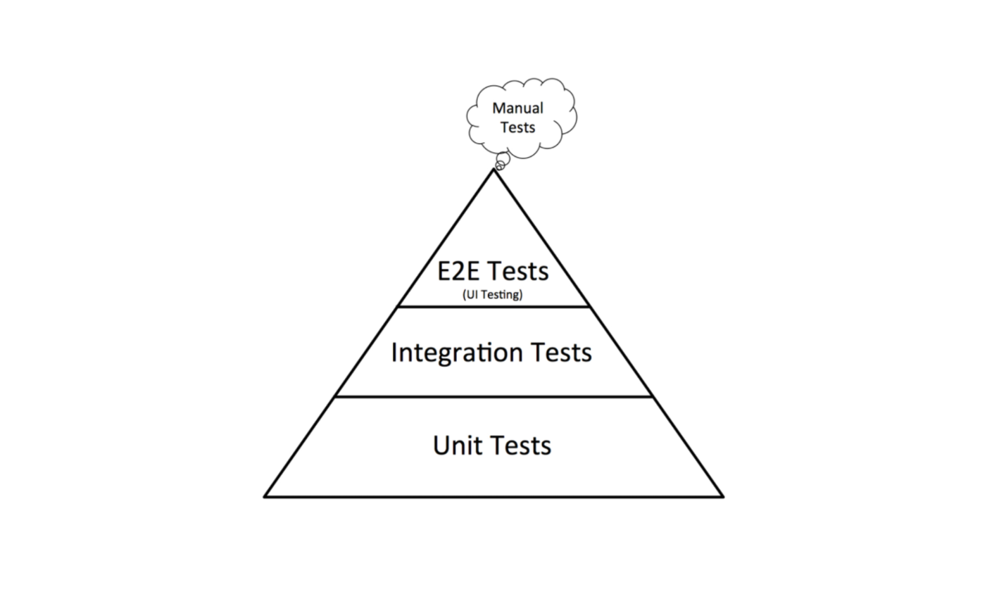

# Tests & Quality

After drafting the first working version of [REserve](https://npmjs.com/package/reserve), **behavior validation** and **quality assessment** were some of the remaining **challenges**. This article will detail the different **strategies** adopted for **testing** as well as the **tooling** used to ensure the **quality** of the project.

## Basic testing

There are many ways to deal with web application testing. On one hand, you may use some [selenium-based tools](https://www.guru99.com/automated-testing-tools.html) (or any [alternative](https://www.guru99.com/selenium-alternatives.html)) to **automate a browser**, run a given set of **scenarios** and assess the **expected results**. On the other hand, you may leverage a simpler **http client** *(for instance [curl](https://curl.haxx.se/) or Node.js' helpers such as [request](https://www.npmjs.com/package/request), [got](https://www.npmjs.com/package/got) or [superagent](https://www.npmjs.com/package/superagent))* and **analyze the responses**.

With regards to this project, the most important thing is to validate the way the **server behaves** according to its configuration. Since it is very **flexible**, every possible combination must be tested and the error management finely controlled.

When the project started, an initial - not to say basic - test was created by building a **small website illustrating most of the features**. First, a mix of different handlers and mappings was consolidated inside a [mappings.json](https://github.com/ArnaudBuchholz/reserve/blob/master/tests/mappings.json) file. Then, two extension files exposed this definition through [http](https://github.com/ArnaudBuchholz/reserve/blob/master/tests/http.json) and [https](https://github.com/ArnaudBuchholz/reserve/blob/master/tests/https.json).

```json
{
  "mappings": [{
    "match": "^/proxy/(https?)/(.*)",
    "url": "$1://$2",
    "unsecure-cookies": true
  }, {
    "match": "^/echo/(.*)$",
    "custom": "./echo.js"
  }, {
    "match": "^/chrome/(.*)$",
    "custom": "./chrome.js"
  }, {
    "match": "^/gpf\\.js$",
    "file": "../node_modules/gpf-js/build/gpf.js"
  }, {
    "match": "(.*)",
    "file": "./$1"
  }]
}
```
<u>*Initial mappings used to prototype REserve*</u>

* The first mapping is a typical **proxy** that enables any request on a **remote website**
* The second *(and third)* mapping uses the **custom handler** with a **capturing group**
* The last handler maps the remaining requests to the **file system**

```json
{
  "extend": "./mappings.json",
  "port": 5000
}
```
<u>*http.json file used to expose mappings through http*</u>

Finally, a [web page](https://github.com/ArnaudBuchholz/reserve/blob/master/tests/index.html) was designed to leverage the different mappings and the result was validated with a list of [assertions](https://github.com/ArnaudBuchholz/reserve/blob/master/tests/assertions.js) *(thanks to the [gpf-js http](https://arnaudbuchholz.github.io/gpf/doc/gpf.http.html) helper)*.


<u>*Basic tests executed in a browser*</u>

However, this can hardly be **automated** *(or the lazy me did not want to go with selenium)*.

This is the reason why the **Node.js command line** [all.js](https://github.com/ArnaudBuchholz/reserve/blob/master/tests/all.js) was introduced.

 It **runs** the different configuration files *(http & https)* by creating a **child process** with [child_process.fork](https://nodejs.org/api/child_process.html#child_process_child_process_fork_modulepath_args_options). It relies on REserve's [parent process notification feature](https://github.com/ArnaudBuchholz/reserve/blob/master/index.js#L41) to **wait for the server startup**. Once synchronized, it **executes all the assertions** and then **stops** the server *(by killing the process)*.

## In-depth testing

The previous approach considers the **whole project** as a standalone - monolithic - component and tests it by leveraging **a client**. This is also known as **end to end testing**. If you understand the **[pyramid of test](https://martinfowler.com/articles/practical-test-pyramid.html)**, this category of test is situated almost on the top of it... Meaning that this should be the place where the least effort is being put.



<u>*A simplified version of the pyramid of tests*</u>

Another angle for testing is to **isolate each class and service** by [mocking or stubbing](https://www.martinfowler.com/articles/mocksArentStubs.html#TheDifferenceBetweenMocksAndStubs) their dependencies and **test them individually**. This is known as **unit testing**. It begins the pyramid of tests, meaning this is where most effort should be put.

### mocha

If you are familiar with the [mocha framework](https://www.npmjs.com/package/mocha), you know that it is **simple to implement**, widely used and it supports **asynchronous features** such as promises.

[](https://mochajs.org/)

<u>*Mocha framework logo*</u>

For each source file of the project a **corresponding** test file is created, for instance: [`handlers/custom.js`](https://github.com/ArnaudBuchholz/reserve/blob/master/handlers/custom.js) is tested by [`tests/mocha/handlers/custom.test.js`](https://github.com/ArnaudBuchholz/reserve/blob/master/tests/mocha/handlers/custom.test.js). The directory structure is also recreated under the [mocha tests folder](https://github.com/ArnaudBuchholz/reserve/tree/master/tests/mocha).

This pattern makes the **configuration of mocha easier** since you just need to setup the spec file pattern to `*.test.js`.

When running, it produces a report that helps you identify which **test case failed**.


<u>*Mocha execution excerpt*</u>

### Isolation in a nutshell

As explained before, the project didn't start with the [tests first](https://en.wikipedia.org/wiki/Test-driven_development). As a result, **no encapsulation** was done and the code is heavily relying on **Node.js native APIs**. In particular :
* [fs](https://nodejs.org/dist/latest/docs/api/fs.html) module for accessing the **file system**
* [http](https://nodejs.org/dist/latest/docs/api/http.html) / [https](https://nodejs.org/dist/latest/docs/api/https.html) modules to create the actual **server**
* The [`request`](https://nodejs.org/api/http.html#http_class_http_incomingmessage) and [`response`](https://nodejs.org/api/http.html#http_class_http_serverresponse) objects

It is possible to **substitute any Node.js modules** *(including the native ones)* using [mock-require](https://www.npmjs.com/package/mock-require). This simple API allows you to **predefine a module with a mocked version**. Consequently, whenever the [`require`](https://nodejs.org/api/modules.html#modules_require_id) API is used, the mocked object is returned.

#### Mocking the file system

Mocking the file system is **not really mandatory**: using a **dedicated directory structure** in the project could have been enough.

However, the project aims to run on **any platform**. And, actually, the development environment *(Windows)* is  different from the continuous integration platform one *(Linux)*.

The **file system differences** between operating systems have a **significant impact** on REserve. Indeed, a web server running on a UNIX-like operating system would be **case sensitive** with the URLs. On windows, it might **not**.

Since REserve uses only a **subset of the fs APIs**, a [custom mocked version](https://github.com/ArnaudBuchholz/reserve/blob/master/tests/mocha/mocked_modules/fs.js) was build to redefine **only the APIs that are really used**.

The whole file system is **virtualized** with a dictionary where members are object representing either files *(when they contain a `content` property)* or folders *(when no `content` is found)*.

A specific API controls **whether the file system is case sensitive** or not.

```JavaScript
let caseSensitive = true

function getEntry (entryPath) {
  if (!caseSensitive) {
    entryPath = entryPath.toLowerCase()
  }
  if (entryPath === '/') {
    return entries
  }
  return entryPath.split(path.sep).slice(1).reduce((folder, name) => {
    if (!folder || folder.content) {
      return folder
    }
    return folder[name]
  }, entries)
}
```
<u>*The main function of the virtual file system*</u>

#### Mocking of http, requests & responses

According to REserve, there are not much **differences** between the [http](https://nodejs.org/dist/latest/docs/api/http.html) and the [https](https://nodejs.org/dist/latest/docs/api/https.html) modules. Actually, only two methods are used :
* [createServer](https://nodejs.org/api/http.html#http_http_createserver_options_requestlistener) to initiate the HTTP(s) server
* [request](https://nodejs.org/api/http.html#http_http_request_url_options_callback) to forward the an incoming request to a distant URL *(used by the `url` handler)*

Since these modules are **widely used**, there is **no value** in testing them again. The same way, we want to **simplify the tests** and **avoid going through the http(s)** layer.

As a result :
* the [`createServer`](https://github.com/ArnaudBuchholz/reserve/blob/d72e24c28be010828101201f7890762b255c726d/tests/mocha/http.js#L36) API is **reduced to a single condition** that triggers an error when needed.
* the [`request`](https://github.com/ArnaudBuchholz/reserve/blob/d72e24c28be010828101201f7890762b255c726d/tests/mocha/http.js#L17) API **copy** the request content to the response.

And to enable **individual handlers testing**, REserve provides two classes to **simulate the request and response objects**. They both implement **streams**.

Implementations can be found in:
* [request](https://github.com/ArnaudBuchholz/reserve/blob/master/mock/Request.js)
* [response](https://github.com/ArnaudBuchholz/reserve/blob/master/mock/Resposne.js)

Those classes are **part of the NPM module together with the mock helper**: it provides a **simple test framework** to develop new **custom handlers**.

## Quality tools

How do you make sure that the **code is [maintainable](https://softwareengineering.stackexchange.com/questions/134855/what-characteristics-or-features-make-code-maintainable)** ? **How many tests** are **necessary** to ensure that the **code works** as expected ?

Different **tools** are available to answer those questions.

### Static checks

A [linter](https://blog.logrocket.com/four-options-to-help-you-get-started-linting-your-javascript-b4b829828648/) can **analyze the codebase statically** and **report on common errors**. It usually provides **settings** to define **what must be verified** and how the findings must be treated in terms of **severity**. Sometimes, the linter may even automatically **fix** some of the findings.

For instance :

```JavaScript
if (parameter = '--config') {
  return false
}
```
<u>*An example of faulty code*</u>

```cmd
> standard --fix

standard: Use JavaScript Standard Style (https://standardjs.com)
  .\reserve\index.js:13:9: Expected a conditional expression and instead saw an assignment.
  .\reserve\index.js:13:9: Unexpected constant condition.
```
<u>*The linter output*</u>

A linter can also **check the formatting** being used through the sources, such as the choice between tabs and spaces, how strings should be delimited... This guarantees **consistency when reading** the code and **improves maintainability**.

REserve project uses **[standardJS](https://standardjs.com/)**, a linter based on [ESLint](https://eslint.org/) with a **predefined configuration**.

### Code coverage with Istanbul

One way to check if the tests are **relevant** is to quantify **how many lines of the codebase** are executed during the tests. This operation is called the **code coverage measurement**.

#### The 100% paradox

Before getting into **tools**, I would like to **illustrate one common misunderstanding** about the code coverage.

Let's consider the following **function** :
```JavaScript
function divide (a, b) {
  return a / b;
}
```
<u>*An example of function to be tested*</u>

The test below executes the function and, as a result, it is **enough** to **cover it completely**.
```JavaScript
assert.strictEqual(divide(4,2), 2)
```
<u>*An example of test*</u>

Since we reached **100% of coverage**, does it mean that the **function is fully tested** ?

Actually, **no**. It really depends on the **specification** of the function.

For instance, the following **questions are not answered by the test** :
* What happens if you divide by 0 ?
* What result do you expect when you compute ```divide(1, 3) * 3``` ?
* What happens if you pass parameters that are not numbers ?
* ...

So, to put it in a nutshell, **100% of coverage does not guarantee that everything is tested** but, on the contrary, if **it does not reach 100% of coverage** it means that **some parts are not tested**.

#### Tools

There are many tools to measure the code coverage and most of them require **instrumenting the code base** first. Luckily this step is usually **transparent**.

After the tests execution, the tool produces a **report** that contains :
* The files that were loaded
* The lines that were executed

And depending on the **granularity** :
* The functions that were called
* The branches that were evaluated *(not all tools provide this information)*

This report is important to easily **identify which part of the code needs more tests**.

These metrics are consolidated and **expressed in percentage** of coverage for each category.
**Thresholds** can be defined to **fail** the process when the **percentage does not reach the expectations**.

REserve uses **[nyc](https://www.npmjs.com/package/nyc)** which, itself, relies / is an evolution of [istanbul](https://www.npmjs.com/package/istanbul). The **whole process is easy** since nyc supports the execution of an external command and it **takes care of everything transparently**. Consequently, the code coverage is triggered with `nyc mocha`.

```command
------------------------------------|---------|----------|---------|---------|-------------------
File                                | % Stmts | % Branch | % Funcs | % Lines | Uncovered Line #s
------------------------------------|---------|----------|---------|---------|-------------------
All files                           |     100 |      100 |     100 |     100 |
 reserve                            |     100 |      100 |     100 |     100 |
  body.js                           |     100 |      100 |     100 |     100 |
  checkMethod.js                    |     100 |      100 |     100 |     100 |
  configuration.js                  |     100 |      100 |     100 |     100 |
  dispatcher.js                     |     100 |      100 |     100 |     100 |
  iconfiguration.js                 |     100 |      100 |     100 |     100 |
  index.js                          |     100 |      100 |     100 |     100 |
  interpolate.js                    |     100 |      100 |     100 |     100 |
  mapping.js                        |     100 |      100 |     100 |     100 |
  mock.js                           |     100 |      100 |     100 |     100 |
  schema.js                         |     100 |      100 |     100 |     100 |
  serve.js                          |     100 |      100 |     100 |     100 |
```
<u>*Excerpt of the coverage report*</u>

### Continuous integration

Tests, static checks and code coverage are good ways to assess the quality of the code but **they work only if executed**. A **continuous integration automated pipeline** ensures that **whenever the code is pushed** to the code repository, these **tools are executed**.

REserve leverages the **[Travis CI](https://travis-ci.org/ArnaudBuchholz/reserve) platform** and all these tools are triggered during the build.

Also, the **code coverage results are uploaded** to the [Coveralls platform](https://coveralls.io/github/ArnaudBuchholz/reserve).

### Code smells

Last but not least, the project is also **registered on [Code Climate](https://codeclimate.com/github/ArnaudBuchholz/reserve)**.

This **online platform** performs **code analysis** and detects **maintainability issues** *(usual code smells such as duplicated code, oversized function, code complexity...)*.

The result is **quantified** with a badge [](https://codeclimate.com/github/ArnaudBuchholz/reserve/maintainability) as well as an **estimated cleaning time**.

## Conclusion

To conclude, the project is **fully tested** and its **quality is constantly controlled and measured**. But, still, it can be **improved**. For instance, in terms of **project management**, there are **no stories** or **acceptance criteria** documented. Also, the **tests quality** can be assessed using **[mutation testing](https://en.wikipedia.org/wiki/Mutation_testing)**.
